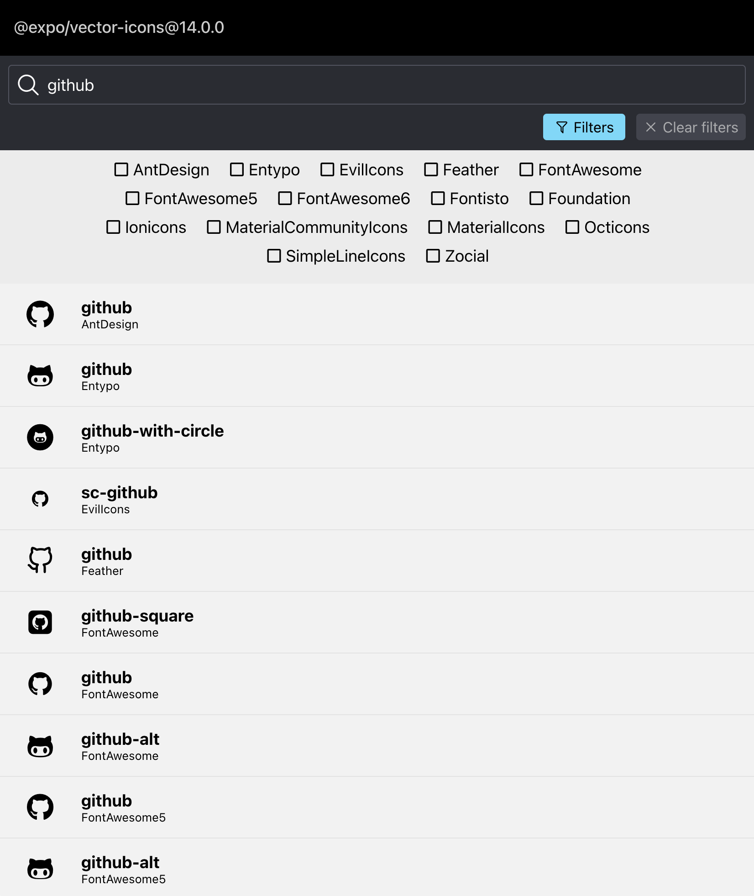

# @expo/vector-icons

> [!TIP]
> As of Expo SDK 54, we recommend using packages from [react-native-vector-icons](https://github.com/oblador/react-native-vector-icons) instead of `@expo/vector-icons`. `react-native-vector-icons` repository (not to be confused with the [deprecated package](https://www.npmjs.com/package/react-native-vector-icons)) offers a set of popular libraries which include the same features (and more!), latest icon sets and more modular packages. Read the [migration guide](https://expo.fyi/migrating-from-expo-vector-icons) to learn more.
>
> This library will continue to receive updates for the near future, but we recommend using icon families from `@react-native-vector-icons` for both new and existing projects.

This library was a compatibility layer around [react-native-vector-icons](https://github.com/oblador/react-native-vector-icons) to work with the Expo asset system. If you're using React Native without Expo, you have no need for this library — carry on! (or maybe [check out Expo](https://expo.dev/)).

## Resources

- [@expo/vector-icons directory](https://icons.expo.fyi/) - a searchable list of all included icons.
- [Font Awesome icons directory](https://fontawesome.com/icons) - all Font Awesome icons (including the Pro icons)
- [Expo documentation](https://docs.expo.dev/)



## Usage

This library is part of the `expo` package, so if you are using `expo` you can simply use it like so

```tsx
import React from 'react';
import Ionicons from '@expo/vector-icons/Ionicons';

export default class IconExample extends React.Component {
  render() {
    return <Ionicons name="md-checkmark-circle" size={32} color="green" />;
  }
}
```

for more usage see [Expo icons documentation](https://docs.expo.io/guides/icons/)

## Maintainers

### How to upgrade the react-native-vector-icons version

I'll be honest with you, it's not straightforward. You should set aside about an hour to do this.

1. Clone [react-native-vector-icons](https://github.com/oblador/react-native-vector-icons)
2. Copy files from the cloned directory into `src/vendor/react-native-vector-icons`, except the dotfiles.
3. Run `git status` and look at the untracked files. Remove anything that doesn't seem needed. For example, remove package.json, react-native.config.js, react-native.osx.js. Things to look out for are new icon fonts or new `create-*` files.
4. Run `git diff **/*.js` - do any of the changes look like they should be synced over to the equivalent `.ts` files in `src`?/

- ToolBarAndroid and TabBarIOS are not included in @expo/vector-icons
- Neither are the native vendor font loading methods.
- Probably there won't be anything important. The main thing to look out for are user-facing API changes, the `@expo/vector-icons` internals are different enough that you don't need to worry about it.
- Were any dependencies added? Check imports against those in the current package.json, see why they were added - maybe they support the `bin` scripts, in which case we need them.
- TypeScript/Flow types for Icon/Icon.Button components may need to be updated.

5. Run `yarn` when you're done and it'll copy vendor files over to build.
6. Go to the website directory, test it out by changing the `@expo/vector-icons` version to `"../"` (TODO: investigate this quirk!). If new icons were added, ensure that they work here.

- While you're here, it would be kind of you to update the Expo SDK version to latest.

7. Publish an alpha release, switch back the version in the website to that version.
8. Open a PR, have someone else like @brentvatne look at it. If it's good to go, publish the final version, update the website version again, then merge. The website will be deployed when you merge to master.

### How to deploy the website

Create a commit on master.
